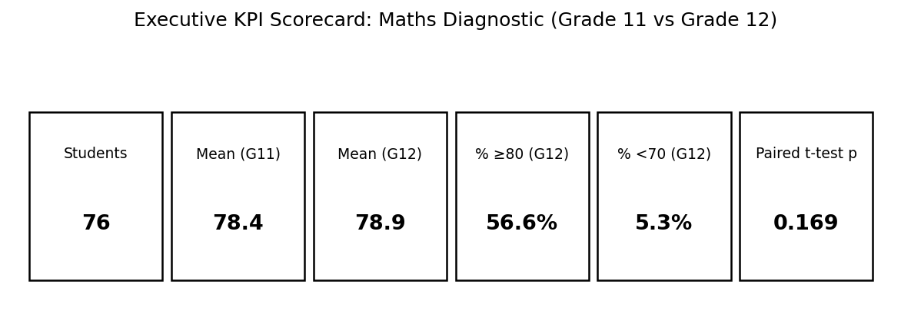
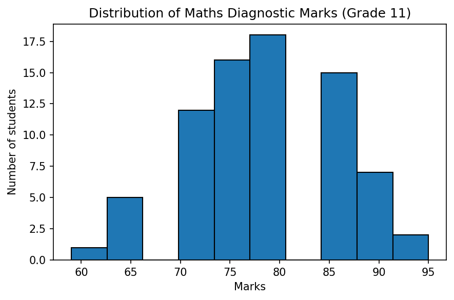
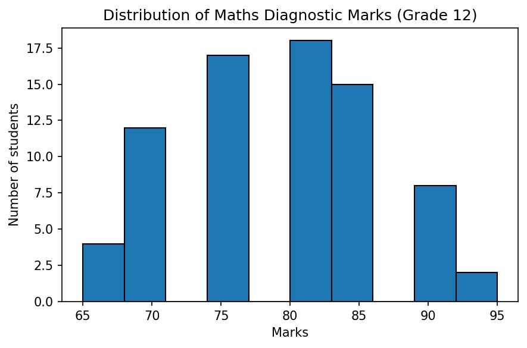
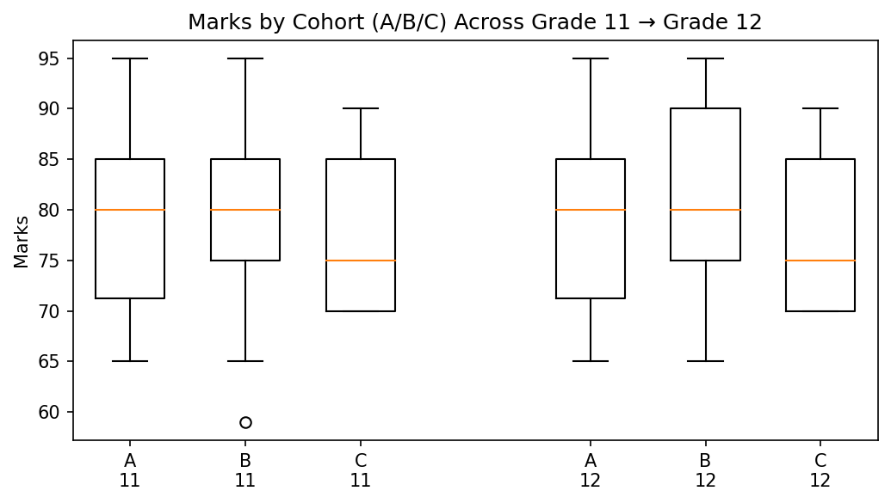
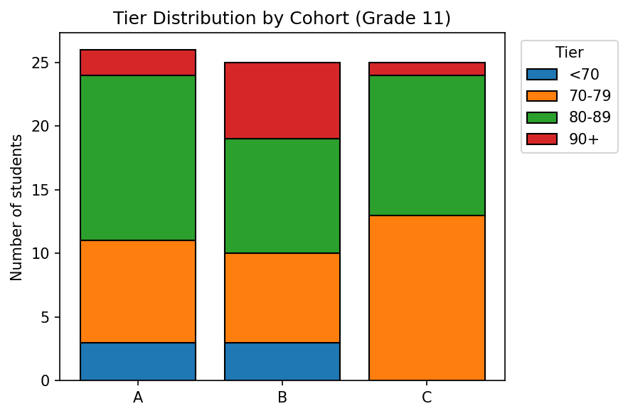
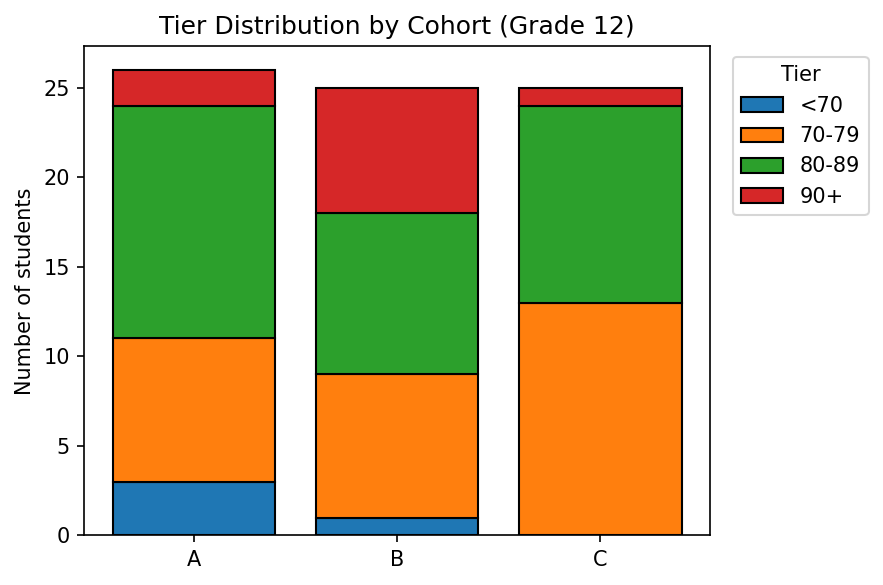
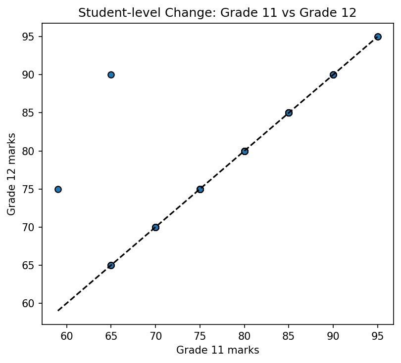
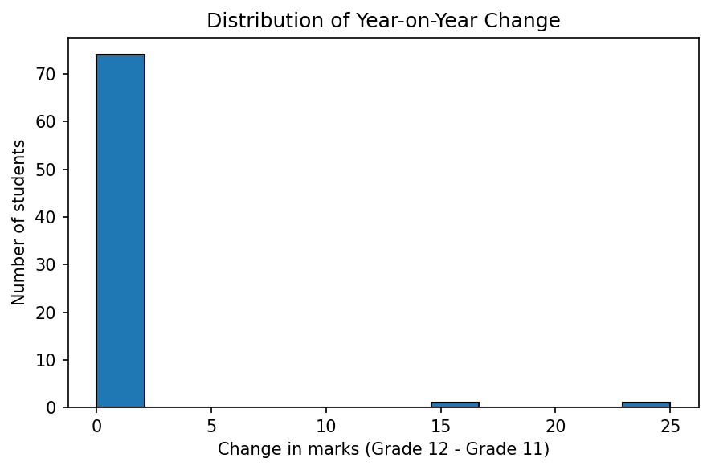
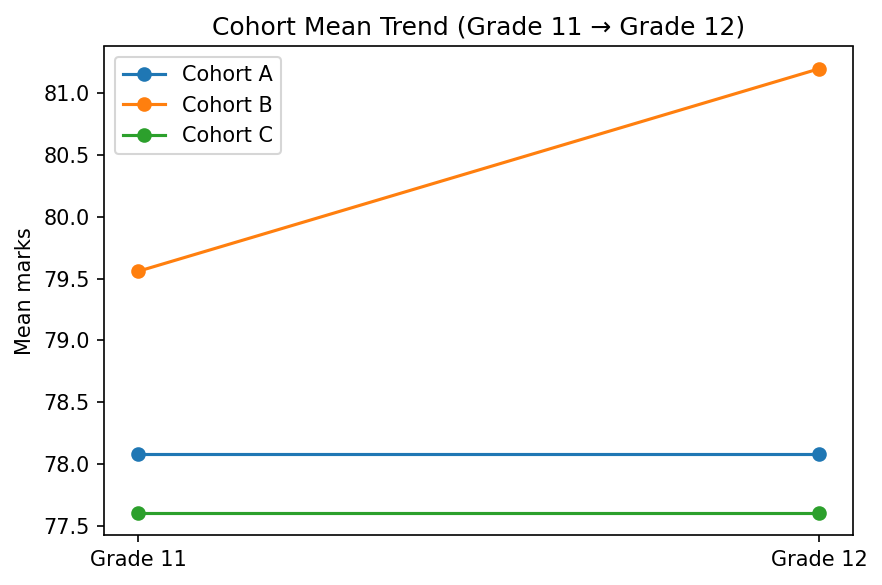

# Emirates Schools Establishment — Maths Diagnostic Performance Analytics (Grades 11 & 12)

> **Role simulated:** Performance Data Analyst (ESE) — performance analytics pipeline, cohort segmentation, data quality controls, and KPI reporting (aligned to responsibilities described in CV).  
> **Dataset:** Maths Diagnostic Test marks for Grades 11A/11B/11C and Grades 12A/12B/12C (same student IDs across both grades).

---

## 1) Project Goals (what this delivers)

1. **Repeatable analytics pipeline**: ingest multi-sheet assessment exports → standardize → validate → publish analysis-ready datasets.
2. **Cohort segmentation**: compare performance across **A/B/C** sections and identify attainment gaps.
3. **Longitudinal view**: track **Grade 11 → Grade 12** growth at student level (paired analysis).
4. **KPI scorecards + visuals**: distribution, benchmarks (≥80, ≥90), risk tiers, and trend insights.
5. **Auditability**: explicit validation rules, outlier flags, and anonymized outputs suitable for GitHub.

---

## 2) Repository Structure

```
ese_performance_project/
  data/
    maths_diagnostic_clean_anonymized.csv
    student_growth_anonymized.csv
    kpi_overall.csv
    kpi_by_cohort_timepoint.csv
  reports/
    REPORT.md   (this file)
    figures/
      *.png
  src/
    etl.py
    analysis.py
```

---

## 3) Data Dictionary (public/anonymized)

### `maths_diagnostic_clean_anonymized.csv`
| Column | Meaning |
|---|---|
| `diagnostic_marks` | Maths diagnostic mark (0–100) |
| `grade` | `"11"` or `"12"` |
| `section` | Original sheet/section label (`11A`, `12B`, etc.) |
| `cohort` | Section letter (`A/B/C`) |
| `timepoint` | `"Grade 11"` or `"Grade 12"` |
| `flag_missing_mark` | Missing mark indicator |
| `flag_out_of_range` | Outside expected bounds (0–100) |
| `flag_outlier_iqr` | IQR-based outlier within (grade, cohort) |
| `student_key` | Anonymized student identifier (SHA-256 truncated) |

### `student_growth_anonymized.csv`
| Column | Meaning |
|---|---|
| `student_key` | Anonymized student identifier |
| `cohort` | A/B/C |
| `Grade 11` | Grade 11 mark |
| `Grade 12` | Grade 12 mark |
| `delta_12_minus_11` | Change (G12 − G11) |

---

## 4) Data Quality Controls (validation rules)

**Implemented controls:**
- **Schema standardization** across sheets (header detection + standardized column naming).
- **Type coercion** for numeric marks and IDs.
- **Range checks**: marks must be in **[0, 100]**.
- **Missingness** flags for audit trails.
- **Outlier flagging**: **IQR rule** within each (grade, cohort).

**Quality summary (this dataset):**
- Missing marks: **0**
- Out-of-range marks: **0**
- IQR outliers flagged: **1** (kept, but clearly flagged)

---

## 5) Executive KPI Scorecard



**Overall (all cohorts):**
- Grade 11 mean: **78.4**
- Grade 12 mean: **78.9**
- % meeting benchmark ≥80 (Grade 12): **56.6%**
- % at-risk <70 (Grade 12): **5.3%**
- Paired t-test (Grade 11 vs Grade 12): **p = 0.169** (no statistically significant mean change)

---

## 6) Exploratory Data Analysis (EDA)

### 6.1 Distributions
**Grade 11**


**Grade 12**


### 6.2 Cohort segmentation (A/B/C)


**ANOVA across cohorts**
- Grade 11: F=0.430, p=0.652
- Grade 12: F=1.809, p=0.171

Interpretation: differences across cohorts are present but **not statistically significant** at α=0.05 in this sample.

### 6.3 Benchmark tiers
Tiering used:
- `<70` (high priority intervention)
- `70–79` (near benchmark)
- `80–89` (benchmark met)
- `90+` (advanced mastery)

**Grade 11**


**Grade 12**


---

## 7) Longitudinal Analysis (Grade 11 → Grade 12)

### 7.1 Student-level change


### 7.2 Change distribution


**Change summary**
- Improved: **2**
- Declined: **0**
- Unchanged: **74**

> Note: This dataset has many identical scores across timepoints, so growth signals are concentrated in a small subset.

### 7.3 Cohort mean trend


---

## 8) Actionable Insights & Intervention List (anonymized)

### 8.1 At-risk students (<70 in either year)
A small group (n=6) falls below 70 in at least one year and should be prioritized for targeted support.

**Suggested intervention logic (example):**
- **Tier <70**: reteach prerequisites + weekly mastery checks
- **Tier 70–79**: exam technique + spaced practice on weak areas
- **Tier 80–89**: enrichment + mixed problem sets
- **Tier 90+**: stretch tasks, peer tutoring roles, competition problems

### 8.2 Notable positive movers
Two students show meaningful gains (Δ>0). Their learning pathway can be investigated and replicated.

---

## 9) How this maps to the Performance Data Analyst role

This project demonstrates:
- **Performance analytics pipeline** (multi-sheet ingestion → standardization → export)  
- **Cohort segmentation** and **attainment gap** reporting  
- **KPI scorecards** and visuals suitable for leadership reporting  
- **Data quality controls** for reliability and auditability  

---

## 10) Next enhancements (if more fields are available later)
If future exports include **topic-level items** (algebra, functions, calculus, etc.), the same pipeline can be extended to:
- topic mastery heatmaps
- skill-gap drilldowns
- item discrimination (difficulty vs. performance)
- predictive risk models and early-warning alerts

---

## Reproducibility
Run:
```bash
python -m pip install -r requirements.txt
python src/etl.py
python src/analysis.py
```

